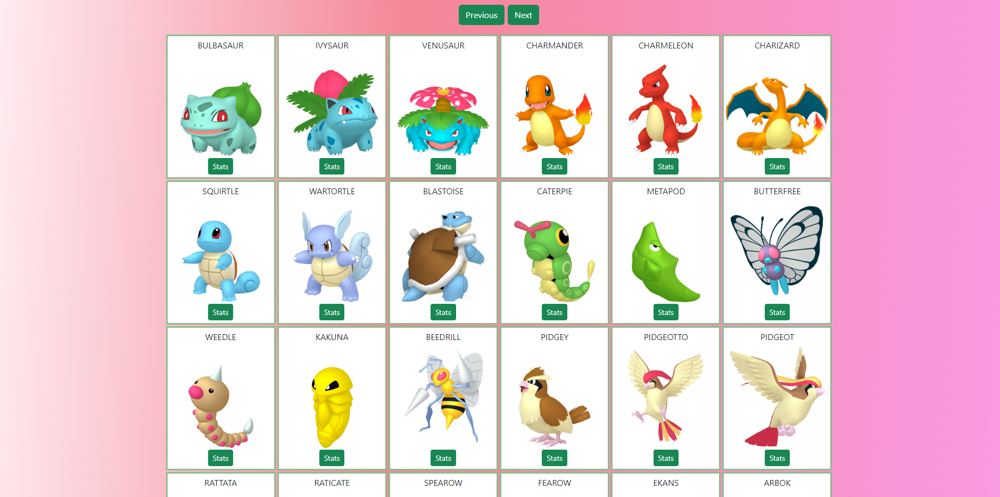
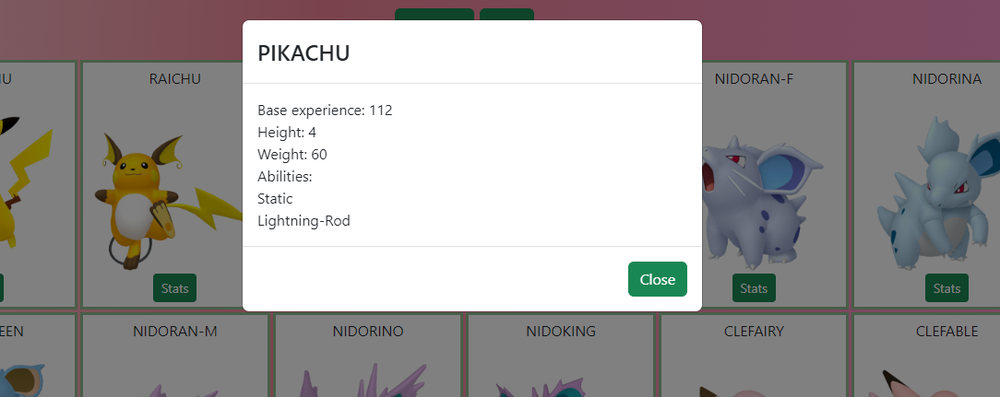

# About Pokemon Browser

A simple Pokemon browser single-page application made with React. This app is using the PokeApi. 

The API is expected to run in the url set in `src/config.ts`.

You can run the API locally with Docker Compose with instructions from:
https://github.com/PokeAPI/pokeapi#docker-and-compose--

I used the following commands:
```
docker-compose up -d
docker-compose exec -T app python manage.py migrate --settings=config.docker-compose
docker-compose exec -T app sh -c 'echo "from data.v2.build import build_all; build_all()" | python manage.py shell --settings=config.docker-compose'
```


